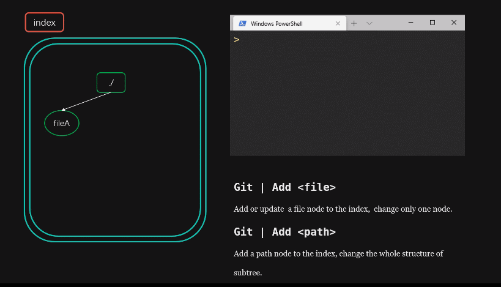
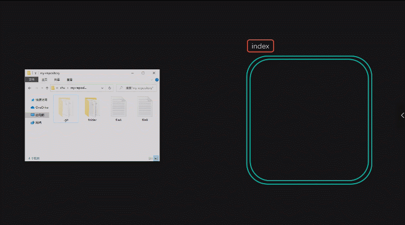
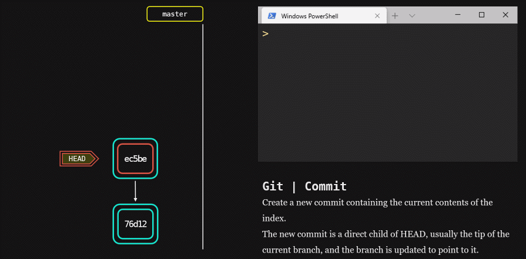
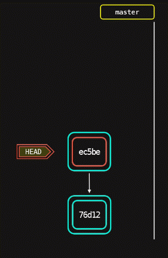
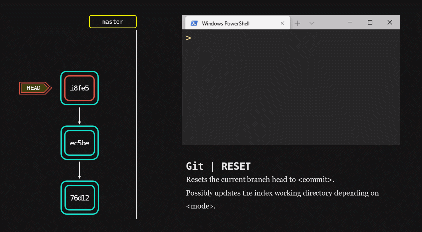
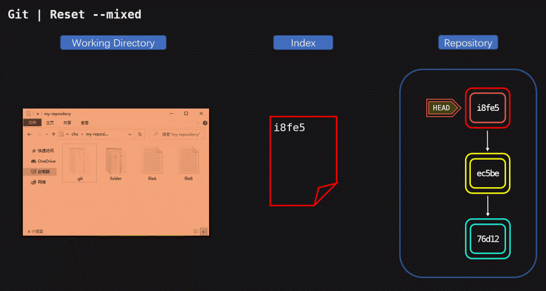
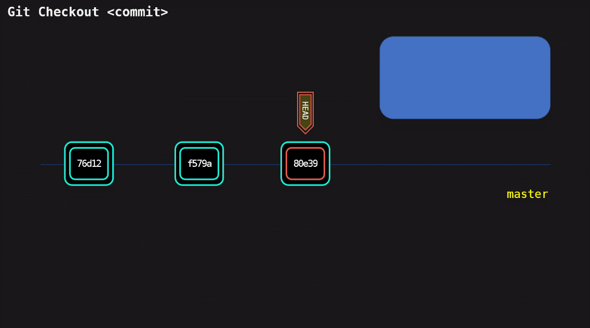

# Git 使用手册

---

# 基本操作

## 初始化

我们选择一个文件夹创建git仓库

```
cd my-repository
git init
```
此时会在`./my-repository`目录下生成`.git`文件夹，这个文件夹存放了git的全部信息。


## 暂存区

工作区(working directory) 指的是`./my-repository`文件夹内除了`.git`文件夹外的所有区域。

暂存区(index) 是对工作区的一个记录，暂存区有点像是一个账单，和大部分账单一样，暂存区是**不会自动**与工作区同步的，需要手动记录。

假设，我们在工作区中创建了一些文件`a.txt, b.txt`，并对其做了一些编辑。

此时，我们没有任何记录操作，所以暂存区没有任何记录

### `git add`

`git add`指令会将工作区中**指定目录或文件**的信息记录到暂存区

```sh
git add a.txt b.txt # 可以是文件 可以有多个值
# or
# git add *.txt # 可以使用正则表达式
# git add ./  # 可以是目录
```

该指令有两个功能：

* 如果暂存区没有该文件/目录的任何记录，则在暂存区**创建**一个记录；
* 如果暂存区已经存在该文件/目录的记录，则**更新**记录的值


> 更专业的解释是：
>
> 暂存区以文件树结构存储工作区的信息，每一个结点都是一个文件/目录
>
> 当使用`git add`向暂存区添加一条信息时，有两种情况：
>
> * 若文件树中没有该文件（添加新文件），则创建一个新的结点
> * 若文件树中已经存在同名的结点（修改旧文件），则比对两者的区别，更新对应结点的状态


`git add`指令的参数还可以是一个目录`<path>`，与参数是文件的情况不同，如果暂存区已经存在了这个目录，那么git会对比两个结点的区别，将**新的结点子树**替换原来的结点子树结构，这意味着该目录结点下的所有子结点不仅会被**创建**、**修改**，还会因为文件树结构的改变，被从暂存区**删除**。



### `git rm`

`git rm`指令的用法与`git add`类似，其作用是将记录从暂存区**删除**（从记录的文件树中删除指定结点）

```sh
git rm a.txt
# or another way
# git add ./ 
```


于是，暂存区的删除记录的操作会有两种实现方式：

* 方式一：使用`git rm`指令直接将结点记录从暂存区删除
* 方式二：在工作区删除相应的文件后，再使用`git add <path>`指令更新所在目录，这样新的目录结点子树（不含该文件结点的子树）会替换掉原来的子树（含有该文件结点的子树），该文件记录也就不存在了。

> 通常情况下，习惯使用一个`git add`指令，而不使用两个指令


### `git status`

我们使用`git status -s`来查看暂存区的状态，其中参数`-s`表示以简洁形式输出信息

```
PS C:\my-repository> git status -s
A  a.txt
A  b.txt
```

文件前面的字母表示状态:
 * "??" 未追踪
 * "!!" 已忽略
 * "A"  已添加至暂存区 
 * "D"  已删除


# 版本控制

## 版本库

暂存区(index)记录了工作区的某个时刻的状态。虽然需要手动操作`git add`等指令来实现二者的完全同步。

使用`git commit`指令会将**暂存区**提交为一个`commit`，依顺序添加的若干commits就形成了一条仓库的状态变化线——分支（merge）

> commit：可以译作提交、版本或者快照，是git版本管理的**基本单位**



**版本库**包含了所有的分支，其中默认分支叫做`master`

> 在多人协作的项目中，我们一般会各自维护一条自己的分支，独立开发各自的任务，最后将合并项目，在名为`dev`的分支上发布测试版的项目，在主分支`master`上发布正式版。
>
> 分支的具体介绍在后面。


## `git commit`

使用`git commit`指令会将**暂存区**提交一个`commit`到当前的分支上



极力建议，用下面的方式使用`git commit`指令：


```
git commit -m <description>
```

`-m`参数会附加对该commit的说明，良好的注释能够使版本库迭代关系更加清晰，这点在协同工作时尤为重要。


>注意：`git commit`提交的**是暂存区**，而**不是工作区**，所以，每次提交前，切记一定要使用`git add`指令将工作区和暂存区同步


## `git log`

我们对版本库进行几次版本迭代。

> 再三强调：一定要先`git add`再`git commit`

可以使用`git log`指令查看这个仓库的版本迭代记录


```
PS C:\Users\chu\my-repository> git log
commit 81ea8f1079c52fc994d464a2a6d6e507cfe93ddb (HEAD -> master)
Author: chuhao <chuhao_96@foxmail.com>
Date:   Wed Apr 15 20:11:34 2020 +0800

    edit b

commit 1ff0e675cc1fbe5fb30215d7321ac56dc3c5b5b9
Author: chuhao <chuhao_96@foxmail.com>
Date:   Wed Apr 15 20:11:08 2020 +0800

    add c

commit 77a2ed9f4d6d760ef454feb632771481fddf2582
Author: chuhao <chuhao_96@foxmail.com>
Date:   Wed Apr 15 20:10:40 2020 +0800

    add a b
```

分支的每个结点(commit)都有形如`f7a61ec1..`这样的唯一编号，这是通过SHA算法生成的与commit唯一对应的标识。我们通过这些ID标识区分不同的commit结点。

> 在能够区分开的前提下，可以简写id，即只写前几位。


`git log`指令还可以使用`--oneline`参数 以简要格式输出：

```sh
PS C:\Users\chu\my-repository> git log --oneline
81ea8f1 (HEAD -> master) edit b
1ff0e67 add c
77a2ed9 add a b
```
使用`--graph`参数 将以图的形式显示各个版本之间的迭代关系，当我们的commit依赖关系复杂，或者有分支结构时，可以增加该参数。（虽然还是很难分辨，但总比没有好）

```
PS C:\Users\chu\my-repository> git log --graph
* commit 81ea8f1079c52fc994d464a2a6d6e507cfe93ddb (HEAD -> master)
| Author: chuhao <chuhao_96@foxmail.com>
| Date:   Wed Apr 15 20:11:34 2020 +0800
|
|     edit b
|
* commit 1ff0e675cc1fbe5fb30215d7321ac56dc3c5b5b9
| Author: chuhao <chuhao_96@foxmail.com>
| Date:   Wed Apr 15 20:11:08 2020 +0800
|
|     add c
|
* commit 77a2ed9f4d6d760ef454feb632771481fddf2582
  Author: chuhao <chuhao_96@foxmail.com>
  Date:   Wed Apr 15 20:10:40 2020 +0800

      add a b
```

## `git diff`

我们可以使用`git diff`指令比较两个快照的区别

```
git diff <commit> #只有一个值，会比较该commit与暂存区的区别

git diff <commit ID1> <commit ID2>  #比较两个commit的区别
```


输出的是**合并格式diff的变体**，它的输出含义如下：

```bash
PS C:\Users\chu\my-repository> git diff 81ea8f1 1ff0e67
diff --git a/b.txt b/b.txt #git格式的diff
index f761ec1..271e279 100644 # 哈希值比较
--- a/b.txt # 进行比较的文件  a版本的b.txt和b版本的b.txt 
+++ b/b.txt # ---表示变动前，+++表示变动后
@@ -1,2 +1 @@ # 标准的合并diff格式 ，-表示变动前，1,2表示版本a的b.txt是从1到2行，+表示变动后，版本b的b.txt只有1行
 bbb #这里是具体区别
+ddd # +号表示相对增加了的内容，相反，-号表示相对减少的内容

```


## HEAD

应当注意到，在示意图中，有一个`HEAD`标签，它总是表示当前分支的最新结点，这也可以作为commit的相对标识。

> 可以用`HEAD~n`来表示当前commit后的第n个commit，例如：分支的上一个commit可以表示为`HEAD~1`




## 版本回退

### `git reset`

`git reset`指令用于将版本库的状态设定为指定commit的状态，从原理上讲，因为`HEAD`标签标识分支的首部，所以仅仅只是将`HEAD`标签移动到了指定的commit上。




`git reset [--mode] commit`有三种模式(mode)：

* `--hard`：将版本库、暂存区（index）、工作区全部回退到指定的commit，完全丢弃掉之前的commit
	
  

* `--soft`：不修改工作区和暂存区，仅仅修改版本库，将`HEAD`标签移动至指定commit

  

* `--mixed(default)`：默认的模式，不改变工作区，只改变暂存区和版本库

  


`git reset`根据不同的模式，把版本库的状态还原到暂存区或工作区，

那也就意味着保存在暂存区的状态也可以还原到工作区。

### `git checkout`

`git checkout `指令可以用来从暂存区和版本库中还原某一个文件到工作区。

```
git checkout [<tree-ish>] [--] <pathspec>…
```

该指令会将工作区中与`<pathspec>`匹配的内容覆盖掉，如果没有给出`<tree-ish>`，即commit的标识，那么会使用暂存区中相匹配的内容覆盖工作区。

> `git reset`后，如果没有新的commit，原来的版本历史线还是存在的，可以使用`git relog`查看过往的reset命令，找到对应的commitID，用`git checkout`指令还原到reset前的版本。

> `git checkout`，在分支管理中会进一步讲解。

# 分支管理

## 分支的增删改查

### `git branch`

`git branch`指令用来列出、创建或删除分支

```sh
# 查看分支
# 当前分支前会有*标识
git branch 

# 创建分支
git branch <newBranch>

# 删除分支
git branch -d <branch>
```

### `git switch`

`git switch`指令用于切换分支

```sh
git switch <branch>
```


### `git checkout`

`git checkout`可作用于`<commit>`或`<branch>`

```powershell
git checkout <branch> #切换分支
git checkout -b <newBranch> # 创建新分支并切换，相当于git branch + git switch两条指令
```


注意，当使用`git checkout <commit>`时，实际上是在当前分支的`<commit>`节点，重新创建出一条没有名字的分支，这之后的`commit`操作都是在向匿名分支提交。



当我们，重新切换分支时，匿名分支因为没有名字而被垃圾回收机制回收。


所以推荐结合`-b`参数使用，`-b`为匿名分支添加名字，这样分支就会一直存在

`git checkout -b <branch> <commit>`


## 合并分支

【努力更新中……】

【后面准备结合这个帖子做一下总结，挖的坑太多了，填不完了】

https://dev.to/lydiahallie/cs-visualized-useful-git-commands-37p1

## 解决冲突

【努力更新中……】